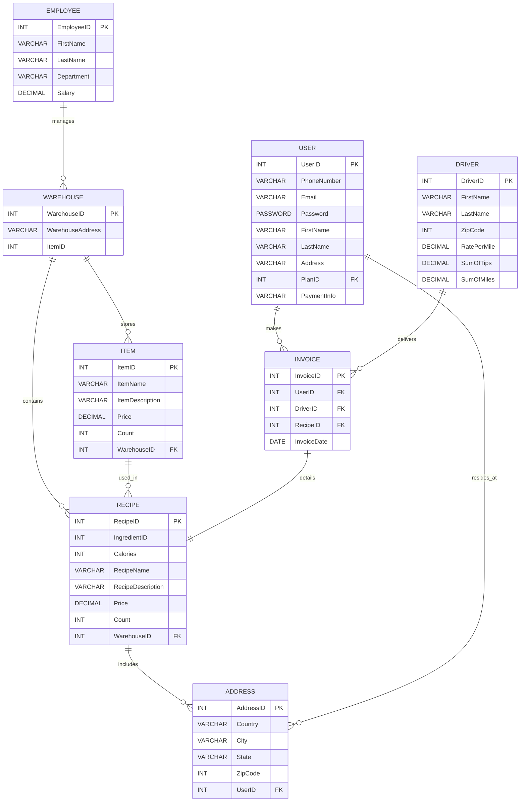

```mermaid
erDiagram
    EMPLOYEE {
        INT EmployeeID PK
        VARCHAR FirstName
        VARCHAR LastName
        VARCHAR Department
        DECIMAL Salary
    }

    WAREHOUSE {
        INT WarehouseID PK
        VARCHAR WarehouseAddress
        INT ItemID
    }

    ITEM {
        INT ItemID PK
        VARCHAR ItemName
        VARCHAR ItemDescription
        DECIMAL Price
        INT Count
        INT WarehouseID FK
    }

    RECIPE {
        INT RecipeID PK
        INT IngredientID
        INT Calories
        VARCHAR RecipeName
        VARCHAR RecipeDescription
        DECIMAL Price
        INT Count
        INT WarehouseID FK
    }

    USER {
        INT UserID PK
        VARCHAR PhoneNumber
        VARCHAR Email
        PASSWORD Password
        VARCHAR FirstName
        VARCHAR LastName
        VARCHAR Address
        INT PlanID FK
        VARCHAR PaymentInfo
    }

    ADDRESS {
        INT AddressID PK
        VARCHAR Country
        VARCHAR City
        VARCHAR State
        INT ZipCode
        INT UserID FK
    }

    DRIVER {
        INT DriverID PK
        VARCHAR FirstName
        VARCHAR LastName
        INT ZipCode
        DECIMAL RatePerMile
        DECIMAL SumOfTips
        DECIMAL SumOfMiles
    }

    INVOICE {
        INT InvoiceID PK
        INT UserID FK
        INT DriverID FK
        INT RecipeID FK
        DATE InvoiceDate
    }

    %% Relationships between the tables
    EMPLOYEE ||--o{ WAREHOUSE : manages
    %% Each warehouse has one employee managing it, but employees can manage multiple warehouses.

    WAREHOUSE ||--o{ ITEM : stores
    %% Warehouses can store a lot of items, but each item is stored in just one warehouse.

    WAREHOUSE ||--o{ RECIPE : contains
    %% A warehouse can have multiple recipes, but a recipe is tied to one warehouse.

    ITEM ||--o{ RECIPE : used_in
    %% Items can be used in several recipes, and recipes use a bunch of different items.

    RECIPE ||--o{ ADDRESS : includes
    %% Recipes might include ingredients from specific addresses (like suppliers or other locations).

    USER ||--o{ ADDRESS : resides_at
    %% Users can have a bunch of addresses (like home and work), but each address is linked to just one user.

    USER ||--o{ INVOICE : makes
    %% A user can make a lot of invoices (like one for each order), but each invoice belongs to just one user.

    DRIVER ||--o{ INVOICE : delivers
    %% Drivers deliver multiple invoices, but each invoice is assigned to one specific driver.

    INVOICE ||--|| RECIPE : details
    %% Each invoice is for one recipe, but recipes can show up on multiple invoices.

```

Schema Diagram:

Employee(EmployeeID, FirstName, LastName, Department, Salary)