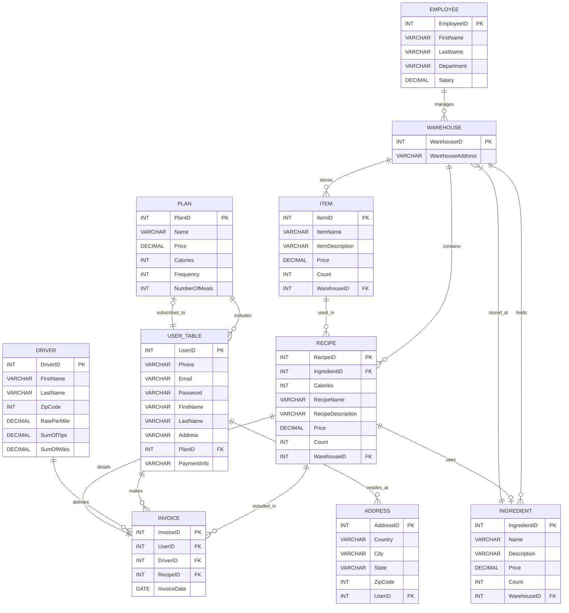

```mermaid
erDiagram
    EMPLOYEE {
        INT EmployeeID PK
        VARCHAR FirstName
        VARCHAR LastName
        VARCHAR Department
        DECIMAL Salary
    }

    WAREHOUSE {
        INT WarehouseID PK
        VARCHAR WarehouseAddress
    }

    ITEM {
        INT ItemID PK
        VARCHAR ItemName
        VARCHAR ItemDescription
        DECIMAL Price
        INT Count
        INT WarehouseID FK
    }

    RECIPE {
        INT RecipeID PK
        INT IngredientID FK
        INT Calories
        VARCHAR RecipeName
        VARCHAR RecipeDescription
        DECIMAL Price
        INT Count
        INT WarehouseID FK
    }

    PLAN {
        INT PlanID PK
        VARCHAR Name
        DECIMAL Price
        INT Calories
        INT Frequency
        INT NumberOfMeals
    }

    DRIVER {
        INT DriverID PK
        VARCHAR FirstName
        VARCHAR LastName
        INT ZipCode
        DECIMAL RatePerMile
        DECIMAL SumOfTips
        DECIMAL SumOfMiles
    }

    USER_TABLE {
        INT UserID PK
        VARCHAR Phone
        VARCHAR Email
        VARCHAR Password
        VARCHAR FirstName
        VARCHAR LastName
        VARCHAR Address
        INT PlanID FK
        VARCHAR PaymentInfo
    }

    ADDRESS {
        INT AddressID PK
        VARCHAR Country
        VARCHAR City
        VARCHAR State
        INT ZipCode
        INT UserID FK
    }

    INGREDIENT {
        INT IngredientID PK
        VARCHAR Name
        VARCHAR Description
        DECIMAL Price
        INT Count
        INT WarehouseID FK
    }

    INVOICE {
        INT InvoiceID PK
        INT UserID FK
        INT DriverID FK
        INT RecipeID FK
        DATE InvoiceDate
    }

    %% Relationships between the tables
    EMPLOYEE ||--o{ WAREHOUSE : manages
    WAREHOUSE ||--o{ ITEM : stores
    WAREHOUSE ||--o{ RECIPE : contains
    WAREHOUSE ||--o{ INGREDIENT : holds

    ITEM ||--o{ RECIPE : used_in

    RECIPE ||--o{ INVOICE : included_in
    RECIPE ||--o| INGREDIENT : uses

    USER_TABLE ||--o{ ADDRESS : resides_at
    USER_TABLE ||--o{ INVOICE : makes
    USER_TABLE ||--o| PLAN : subscribes_to

    DRIVER ||--o{ INVOICE : delivers

    INVOICE ||--|| RECIPE : details

    INGREDIENT ||--|{ WAREHOUSE : stored_at
    PLAN ||--o{ USER_TABLE : includes
```
